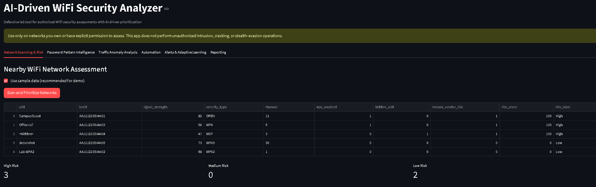
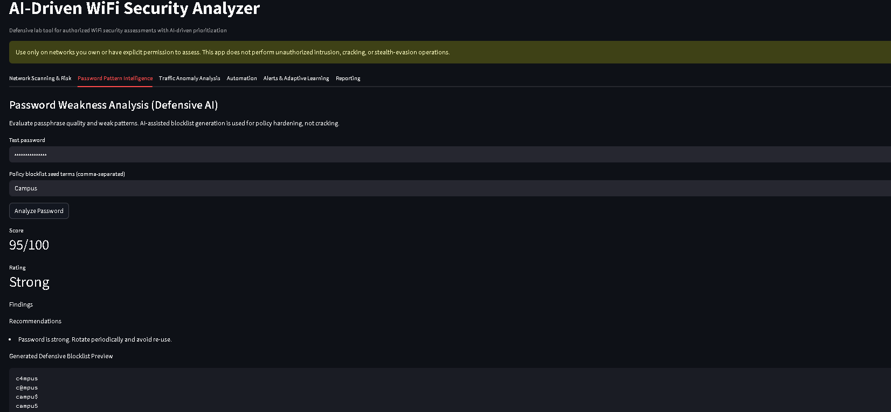
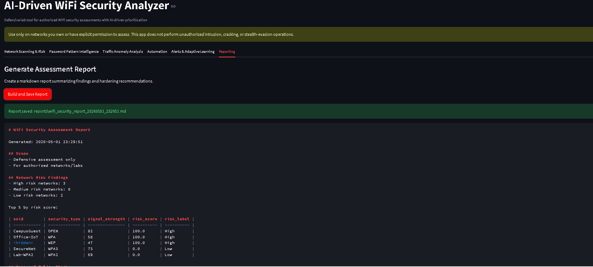

# AI-Driven WiFi Security Analyzer (Defensive)

This project is a defensive, instructor-friendly implementation of an AI-assisted WiFi security assessment dashboard with end-to-end automation.

## Important Ethics and Legal Notice
- Use only on networks you own or have explicit written permission to assess.
- This project is for authorized security auditing and education.
- No unauthorized cracking, intrusion, or stealth-evasion actions are implemented.

## What This Project Delivers

### 🎯 New: Professional SOC Dashboard (React + Flask)
- Modern, responsive web interface with dark SOC theme
- Real-time security metrics and KPI dashboard
- 📊 Interactive charts and data visualizations
- 🚨 Real-time alert management system
- 🔍 Advanced network scanning interface
- 🔐 Enhanced password strength analyzer
- 📡 Network traffic analysis and anomaly detection
- 📄 Automated security report generation
- ⚡ Fast performance with optimized frontend
- 📱 Mobile-responsive design

### 🔬 Core Analysis Features
- Real-time nearby network discovery (Windows netsh or Linux nmcli) with fallback sample data.
- AI-driven network risk prioritization using a Decision Tree classifier.
- Defensive password intelligence:
   - Strength and weak-pattern auditing.
   - Generated defensive blocklist variants for policy hardening.
- Packet feature anomaly detection using Isolation Forest.
- Synthetic benign behavior generation for defensive IDS/monitoring validation.
- Real-time alert panel with severity levels.
- Adaptive learning from historical assessments (trend-based insights).
- One-click end-to-end automation workflow.
- Automated markdown report generation with AI insights and recommendations.

## Architecture

### 🌐 Frontend (React + Tailwind CSS)
- `frontend/src/components/`: Reusable UI components (Header, MetricCard, AlertCard, etc.)
- `frontend/src/pages/`: Dashboard pages (Dashboard, NetworkScanner, PasswordAnalyzer, etc.)
- `frontend/src/App.jsx`: Main application with routing logic
- `frontend/package.json`: Frontend dependencies (React, Tailwind, Chart.js)

### 🔌 Backend (Flask API)
- `backend.py`: Flask API server connecting to analyzer modules
- RESTful endpoints for scanning, analysis, alerts, and reporting
- CORS-enabled for frontend communication

### 🧠 Analysis Engine (Python)
- `app.py`: Legacy Streamlit dashboard and workflow orchestration.
- `src/analyzer/scanner.py`: Passive network discovery and parsing.
- `src/analyzer/risk_ai.py`: Model training/loading and risk scoring.
- `src/analyzer/password_audit.py`: Defensive password quality and pattern analysis.
- `src/analyzer/traffic_analysis.py`: Traffic feature anomaly detection.
- `src/analyzer/defensive_behavior.py`: Benign behavior simulation dataset generator.
- `src/analyzer/alerts.py`: Real-time security alert generation.
- `src/analyzer/adaptive_learning.py`: Historical run tracking and trend insights.
- `src/analyzer/automation.py`: End-to-end automated assessment runner.
- `src/analyzer/reporting.py`: Report generation and file export.

### 📊 Legacy Streamlit Dashboard

#### Network Scanning & Risk
Real-time network discovery, AI-driven risk prioritization, and status metrics.


#### Password Pattern Intelligence
Defensive password strength analysis with AI-generated hardening blocklist suggestions.


#### Reporting
Automated markdown report generation with findings, alerts, and hardening recommendations.


## Setup

### 🚀 Quick Start - New SOC Dashboard (Recommended)

**One-Command Setup:**

```bash
# Linux/macOS
chmod +x start-dashboard.sh && ./start-dashboard.sh

# Windows
start-dashboard.bat
```

This will automatically install dependencies and start both the backend and frontend.

**Manual Setup:**

1. Create virtual environment:
   ```bash
   python -m venv .venv
   source .venv/bin/activate  # Linux/macOS
   # or
   .\.venv\Scripts\Activate.ps1  # Windows
   ```

2. Install Python dependencies:
   ```bash
   pip install -r requirements.txt
   ```

3. Start backend (Terminal 1):
   ```bash
   python backend.py
   ```
   Backend runs on: http://localhost:5000

4. Start frontend (Terminal 2):
   ```bash
   cd frontend
   npm install
   npm run dev
   ```
   Frontend runs on: http://localhost:3000

---

### 📊 Legacy Setup - Streamlit Dashboard

1. Create virtual environment:
   - Windows PowerShell:
     ```powershell
     python -m venv .venv
     .\.venv\Scripts\Activate.ps1
     ```
2. Install dependencies:
   ```powershell
   pip install -r requirements.txt
   ```
3. Run dashboard:
   ```powershell
   streamlit run app.py
   ```

## How to Run the Project

### 🚀 Run the New SOC Dashboard (Recommended)

**Quick Start - All Platforms:**
```bash
# Linux/macOS
chmod +x start-dashboard.sh && ./start-dashboard.sh

# Windows
start-dashboard.bat
```

**Manual Start:**

1. **Set up a virtual environment:**
   - Open a terminal and navigate to the project directory.
   - Create a virtual environment:
     ```bash
     python -m venv .venv
     ```
   - Activate it:
     - **Windows (PowerShell):** `.\.venv\Scripts\Activate.ps1`
     - **macOS/Linux:** `source .venv/bin/activate`

2. **Install Python dependencies:**
   ```bash
   pip install -r requirements.txt
   ```

3. **Start Backend (Terminal 1):**
   ```bash
   python backend.py
   ```
   Backend runs on: **http://localhost:5000**

4. **Start Frontend (Terminal 2):**
   ```bash
   cd frontend
   npm install
   npm run dev
   ```
   Frontend runs on: **http://localhost:3000**

5. **Open your browser** to http://localhost:3000 and enjoy the dashboard!

---

### 📊 Run the Legacy Streamlit Dashboard

1.  **Set up a virtual environment:**
    *   Open a terminal and navigate to the project directory.
    *   Create a virtual environment:
        ```bash
        python -m venv .venv
        ```
    *   Activate it:
        *   **Windows (PowerShell):** `.\.venv\Scripts\Activate.ps1`
        *   **macOS/Linux:** `source .venv/bin/activate`

2.  **Install dependencies:**
    ```bash
    pip install -r requirements.txt
    ```

3.  **Run the Streamlit dashboard:**
    ```bash
    streamlit run app.py
    ```
    The application will open in your web browser.

## Demo Workflow for Submission

### 🎯 New SOC Dashboard Demo

1. Navigate to **http://localhost:3000** after starting the dashboard.
2. On the **Dashboard** page, view real-time security metrics and alerts.
3. Click **🔍 Network Scanner** tab:
   - Ensure "Use sample data" is checked.
   - Click **Start Scan** to see AI-powered risk scoring.
   - Observe the risk distribution chart and threat breakdown.
4. Click **🔐 Password Analyzer** tab:
   - Test a sample password (e.g., `password123`).
   - View strength score and security recommendations.
5. Click **📡 Traffic Analysis** tab:
   - Click **Analyze Traffic** to see anomaly detection.
6. Click **⚠️ Alerts** tab:
   - View real-time security alerts.
   - Filter alerts by severity level.
7. Click **📄 Reports** tab:
   - Generate a comprehensive security report.
   - Download as markdown file.

### 📊 Legacy Streamlit Dashboard Demo

1. Open dashboard and keep **Use sample data** enabled.
2. In **Network Scanning & Risk**, click **Scan and Prioritize Networks**.
3. In **Password Pattern Intelligence**, audit a sample password (e.g., `password123`) and generate a defensive blocklist preview.
4. In **Traffic Anomaly Analysis**, first click **Generate Benign Baseline Dataset**, then click **Generate Suspicious Activity Dataset** to see how the AI model responds to different patterns.
5. In **Automation**, click **Run Full Assessment Automation**.
6. In **Alerts & Adaptive Learning**, review the generated alerts and the historical trend chart.
7. In **Reporting**, click **Build and Save Report** to generate the final markdown summary.

## Expected Traffic CSV Columns
- protocol (example: TCP, UDP, TLS)
- frame_len (packet length)
- delta_time (time since previous packet)
- src_port
- dst_port

## Included Demo Data
- data/sample_traffic.csv
- data/password_seed_terms.txt

## Notes for Instructor
The originally requested offensive features (password cracking and evasion) have been converted into defensive assessment features to align with legal and ethical cybersecurity practice while preserving the AI-driven assessment workflow expected in the project brief.
