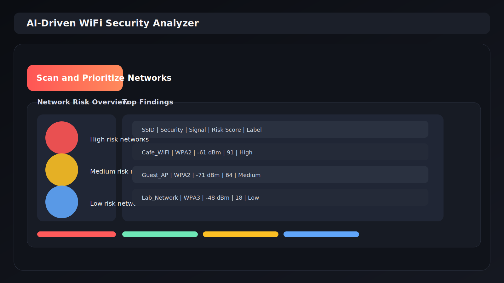
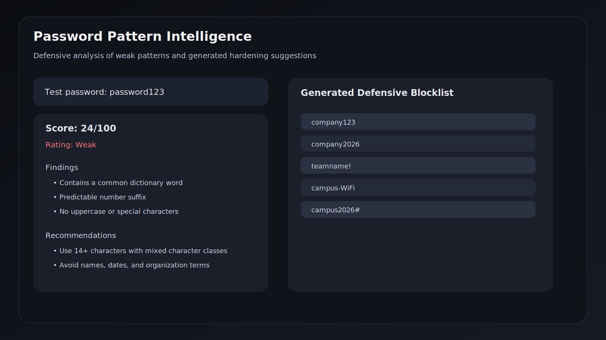
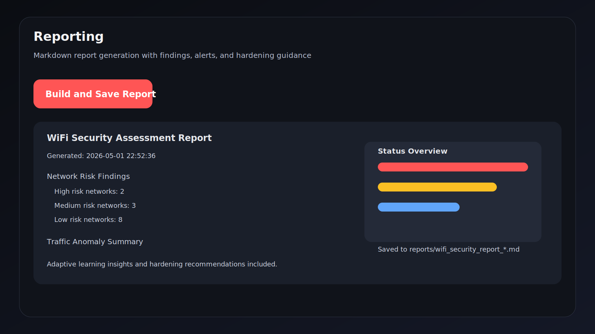

# AI-Driven WiFi Security Analyzer (Defensive)

This project is a defensive, instructor-friendly implementation of an AI-assisted WiFi security assessment dashboard with end-to-end automation.

## Important Ethics and Legal Notice
- Use only on networks you own or have explicit written permission to assess.
- This project is for authorized security auditing and education.
- No unauthorized cracking, intrusion, or stealth-evasion actions are implemented.

## What This Project Delivers
- Real-time nearby network discovery (Windows netsh or Linux nmcli) with fallback sample data.
- AI-driven network risk prioritization using a Decision Tree classifier.
- Defensive password intelligence:
   - Strength and weak-pattern auditing.
   - Generated defensive blocklist variants for policy hardening.
- Packet feature anomaly detection using Isolation Forest.
- Synthetic benign behavior generation for defensive IDS/monitoring validation.
- Real-time alert panel with severity levels.
- Adaptive learning from historical assessments (trend-based insights).
- One-click end-to-end automation workflow.
- Automated markdown report generation with AI insights and recommendations.

## Architecture
- app.py: Streamlit dashboard and workflow orchestration.
- src/analyzer/scanner.py: Passive network discovery and parsing.
- src/analyzer/risk_ai.py: Model training/loading and risk scoring.
- src/analyzer/password_audit.py: Defensive password quality and pattern analysis.
- src/analyzer/traffic_analysis.py: Traffic feature anomaly detection.
- src/analyzer/defensive_behavior.py: Benign behavior simulation dataset generator.
- src/analyzer/alerts.py: Real-time security alert generation.
- src/analyzer/adaptive_learning.py: Historical run tracking and trend insights.
- src/analyzer/automation.py: End-to-end automated assessment runner.
- src/analyzer/reporting.py: Report generation and file export.

## Screenshots
These are illustrative dashboard snapshots added to the repository for the README.

### Network Scanning & Risk


### Password Pattern Intelligence


### Reporting


## Setup
1. Create virtual environment:
   - Windows PowerShell:
     ```powershell
     python -m venv .venv
     .\.venv\Scripts\Activate.ps1
     ```
2. Install dependencies:
   ```powershell
   pip install -r requirements.txt
   ```
3. Run dashboard:
   ```powershell
   streamlit run app.py
   ```

## How to Run the Project
1.  **Set up a virtual environment:**
    *   Open a terminal and navigate to the project directory.
    *   Create a virtual environment:
        ```bash
        python -m venv .venv
        ```
    *   Activate it:
        *   **Windows (PowerShell):** `.\.venv\Scripts\Activate.ps1`
        *   **macOS/Linux:** `source .venv/bin/activate`

2.  **Install dependencies:**
    ```bash
    pip install -r requirements.txt
    ```

3.  **Run the Streamlit dashboard:**
    ```bash
    streamlit run app.py
    ```
    The application will open in your web browser.

## Demo Workflow for Submission
1. Open dashboard and keep **Use sample data** enabled.
2. In **Network Scanning & Risk**, click **Scan and Prioritize Networks**.
3. In **Password Pattern Intelligence**, audit a sample password (e.g., `password123`) and generate a defensive blocklist preview.
4. In **Traffic Anomaly Analysis**, first click **Generate Benign Baseline Dataset**, then click **Generate Suspicious Activity Dataset** to see how the AI model responds to different patterns.
5. In **Automation**, click **Run Full Assessment Automation**.
6. In **Alerts & Adaptive Learning**, review the generated alerts and the historical trend chart.
7. In **Reporting**, click **Build and Save Report** to generate the final markdown summary.

## Expected Traffic CSV Columns
- protocol (example: TCP, UDP, TLS)
- frame_len (packet length)
- delta_time (time since previous packet)
- src_port
- dst_port

## Included Demo Data
- data/sample_traffic.csv
- data/password_seed_terms.txt

## Notes for Instructor
The originally requested offensive features (password cracking and evasion) have been converted into defensive assessment features to align with legal and ethical cybersecurity practice while preserving the AI-driven assessment workflow expected in the project brief.
